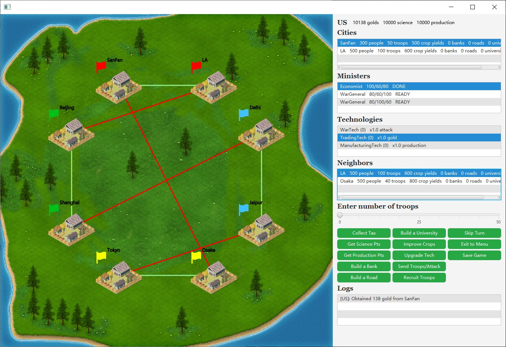
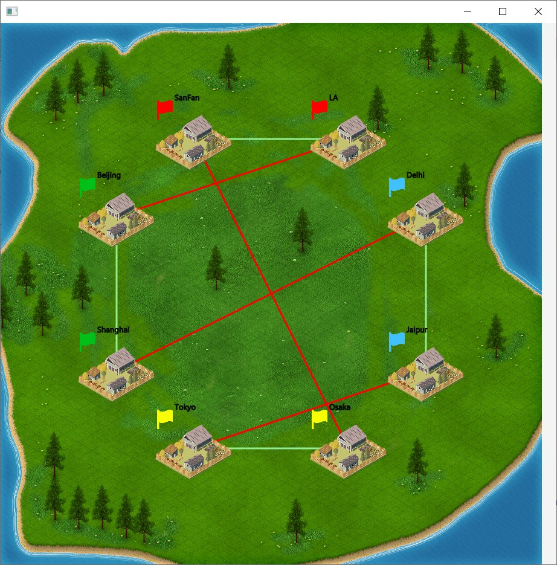
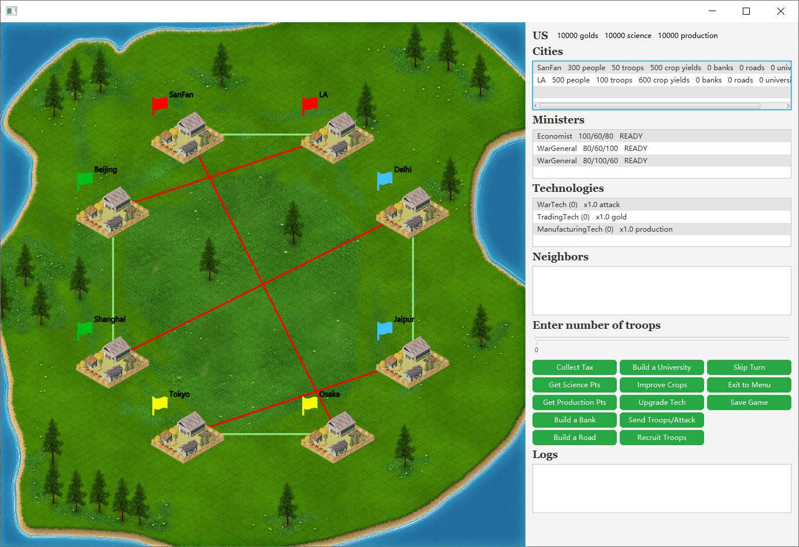
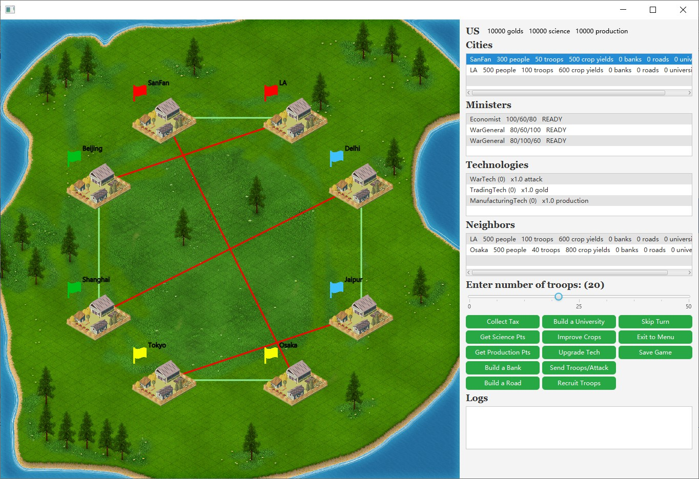
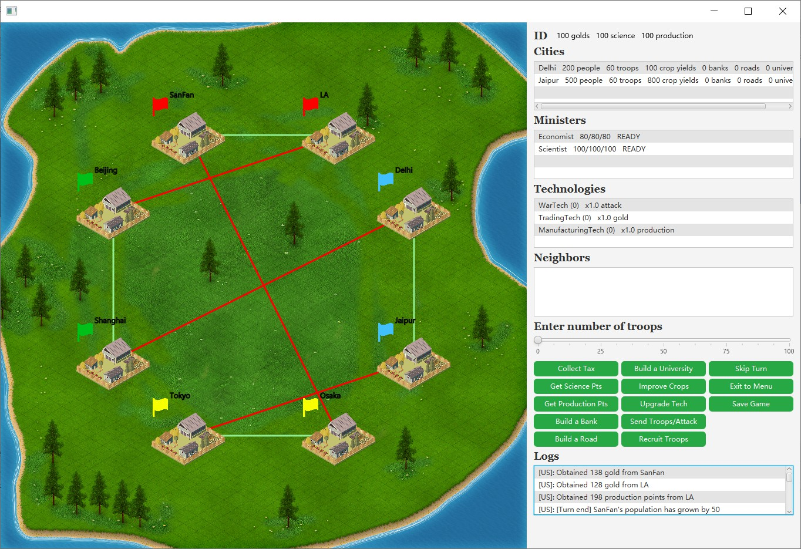
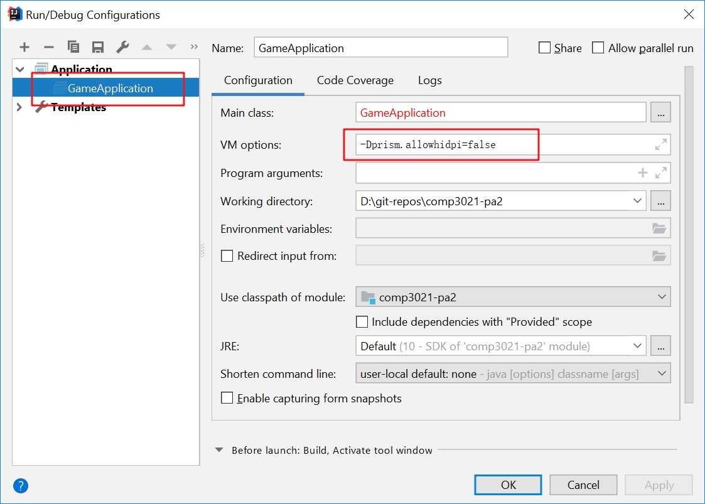
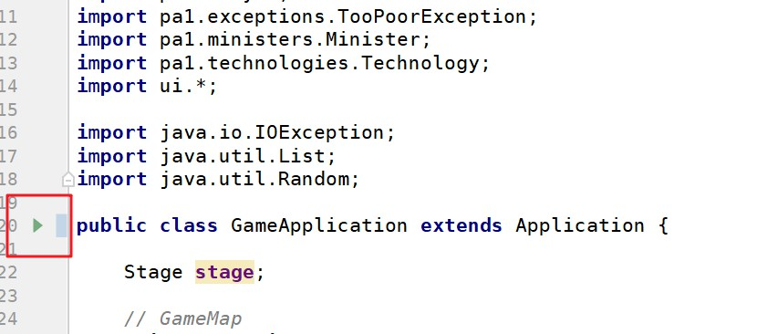
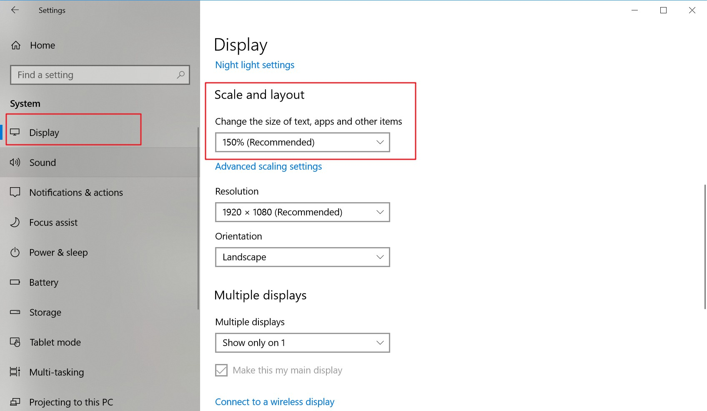

HKUST COMP3021 2019Spring PA2: Discount Civilization
==========================
Overview
--------

-   [Description](#intro)
-   [Skeleton Code](#skeleton)
-   [GUI Introduction](#gui)
-   [Suggested Order to Finish TODOs](#todos)
-   [Disable DPI Scaling](#hidpi)
-   [Submission Details and Deadline](#submission)

* * * * *

<h2 id="intro"> Description </h2>
-----------

The PA2 is an extension of PA1. It is a turn-based multi-player
strategy game. At least one of the players should be a human player,
while the others are computer players. The main extension you need to
make is to change the game's text interface into graphical user
interface, using JavaFX and event handlers. The PA2 will need you to
apply the knowledge you have learnt in Lab 9 (GUI Programming), Lab 10
(Event-driven Programming), and Lab 11 (Java Multi-threading).

* * * * *

<h2 id="skeleton"> Skeleton Code </h2>
-------------

You can download the skeleton code [here](mdres/Comp3021-PA2-Spring2019-Skeleton.zip).
And then import it to IntelliJ.

1.  Unzip the downloaded .zip file to a directory
2.  In IntelliJ go to File \> New \> Project From Existing Sources...
3.  Choose the root directory of the unzipped skeleton code
4.  Choose "Create project from existing sources". Click Next
5.  Make sure that "Project Format" is ".idea". Click Next
6.  When prompted whether you would like to override the project file
    ".idea", click "Yes".
7.  Click Next three times.
8.  When prompted whether you would like to override the module file
    "comp3021-pa2.iml", **click "Reuse"**
9.  When prompted to choose JDK version, choose JDK 10.0.2
10. Click finish

<h2 id = "gui"> GUI Introduction </h2>
----------------

#### The Welcome Screen

 The above
picture shows the welcome screen of the game. There are three buttons in
this interface.

1.  **New Game**: When the "New Game" button is clicked, the game engine
    will create a game using default configuration, and the [Gameplay
    Interface](#gameplay)
    will be shown. 
2.  **Load Game**: This is a bonus task and not implemented in the
    sample program! When the "Load Game" button is clicked, the user
    will be asked to select the map file and the players file. And the
    game engine will load the map and players from the selected files.
    Then the [Gameplay
    Interface](#gameplay)
    will be shown. If you implement this part correctly, then you could
    have upto 6 points of bonus for the PA. But the max score of the PA
    is still capped at 100. For example if you get 97 points for the PA,
    and then you manage to get 4points (out of 6) for implementing the
    store/load functions, you will get min(100,97+6)=100 points for the
    PA. 
3.  **Quit**: When the "Quit" button is clicked. The program stops and
    then exits. The Welcome screen window will be closed.

#### <h4 id = "gameplay"> The Gameplay Interface </h4>

 The above
picture shows the gameplay interface. There are two main parts, the game
canvas on the left and the info bar on the right.

-   **Game Canvas** 
     The game canvas show the cities on the map. Each city has a name, a
    flag representing its owner, and an icon representing its level.
    Neighboring cities are connected by either a green line (if they
    belong to the same player), or a red line (if they belong to a
    different player). You can click a city on the canvas to select it
    if the city belongs to the current player. 
-   **Info Bar** 
     The info bar displays the information of the current player, a
    group of action buttons, and the logs. 
     You may click on the list views to select a
    city/minister/technology/neighbor. 
     The function of the action buttons are as follow:
    -   **Collect Tax**: collect tax from a city. You need to select a
        city and a ready minister.
    -   **Get Science Pts**: collect science points from a city. You
        need to select a city and a ready minister.
    -   **Get Production Pts**: collect production points from a city.
        You need to select a city and a ready minister.
    -   **Build a Bank**, **Build a Road**, **Build a University**:
        build a bank/road/university in a city. You need to select a
        city and a ready minister.
    -   **Improve Crops**: improve the crop yields in a city. You need
        to select a city and a ready minister.
    -   **Upgrade Tech**: upgrade a technology of the current player.
        You need to select a technology and a ready minister.
    -   **Send Troops/Attack**: send troops to a neighboring friend
        city, or attack a neighboring enemy city.
         You need to first select a city and a ready minister, then
        select a neighboring city, then move the slider to choose the
        number of troops to be sent, and finally click the **Send
        Troops/Attack** button.
    -   **Recruit Troops**: recruit troops in a city. You need to select
        a city and a ready minister.
    -   **Skip Turn**: skip the current player's turn even if there are
        some ministers who are still ready.
    -   **Exit to Menu**: stop the game and return to the welcome
        screen.
    -   **Save Game** (bonus! 6 points) : save the game so you can load
        it in the welcome menu. Note the readiness of ministers and the
        current player's index should also be saved.

* * * * *

<h2 id = "todos"> Suggested Order to Finish TODOs </h2>
-------------------------------

You are suggested to finish the TODOs in the following order so it's
easier for you to finish the assignment.

1.  Finish the TODO "construct the Menu pane" in `Menu.java`
     After that. You can run the program and you will see the following
    welcome screen. But the buttons still don't work.
     If the
    welcome screen is too large to fit into your screen, you need to
    follow the instructures
    [here](#hidpi) to disable
    the DPI scaling feature of JavaFX.
    
2.  Finish the following TODOs:
    1.  "initialize all handers" in `GameApplication.java` (event
        handlers will be covered in the lectures on April 25, and April
        30)
    2.  "complete the new game handler" in `GameApplication.java` (event
        handlers will be covered in the lectures on April 25, and April
        30, creating a Runnable computer thread will be discussed on May
        2 and May 7)
    3.  All TODOs in `GameCanvas.java` (very similar to Lab 9, though
        not necessarily 100% the same, drawLinesBetweenCities() is a new
        method not present in Lab 9)

    At that, you can click the "New Game" button. And a gameplay
    interface with only the game canvas will be shown.
    
3.  Finish the following TODOs:
    1.  "begin a player turn" in `GameApplication.java` (creating a
        Runnable computer thread will be discussed on May 2 and May 7)
    2.  "construct the info bar UI" in `InfoBar.java` (this TODO is
        similar to what you have done in Lab 9)
    3.  "display a player in this info bar" in `InfoBar.java` (this TODO
        is similar to what you have done in Lab 9)

    After that, the info bar will be shown on the gameplay interface.
     But
    there is no content inside the neighbors list view, and the button
    groups don't work yet.
4.  Complete the TODO "complete the on selected city changed handler" in
    `InfoBar.java`.
     After that, when you click a city of the current player (either in
    the cities list view or in the game canvas), the neighbors of the
    city will be shown in the neighbors list view. And you may move the
    slider, and the number in the slider label will change accordingly.
    
5.  Complete the following TODOs in `InfoBar.java`:
    1.  "complete the action button handler"
    2.  "disable/enable ALL buttons in this component"

    After that, the action buttons work. You can select the items in the
    list views (and move the slider), then start an action by clicking
    the corresponding button. When it is a computer player's turn, the
    game engine will just wait for a few seconds . But there are still
    some random events invoked for computer players in the
    `endCurrentPlayerTurn()` method in `GameApplication.java`.
    
6.  Complete the remaining TODOs:
    1.  "implement a computer thread that makes random decisions" in
        `GameApplication.java`
    2.  "construct the End Game pane" in `EndGame.java`

    Congratulations! You have finished the assignment! Now you can enjoy
    playing the game you have built!

* * * * *

<h2 id = "hidpi"> Disable DPI scaling </h2>
-------------------

You only need to do this if the interface does not fit into the display
of your computer!

1.  Go to **Run** \> **Edit Configurations**
2.  There should a configuration called **GameApplication**. Select it
    and enter "-Dprism.allowhidpi=false" in the box for "VM options".
    
3.  If there is no configuration called **GameApplication**. Open
    `GameApplication.java` and then click the green triangle on the left
    of the first line of the class defintion. A run configuration will
    then be automatically created.
    
4.  If the interface becomes too small on your screen. You can:
    1.  Delete "-Dprism.allowhidpi=false" in the box for "VM options".
    2.  Change the scaling factor to a lower value in the display
        settings.

    

* * * * *

<h2 id = "submission"> Submission Details and Deadline </h2>
-------------------------------

To submit your PA, you can zip your complete project directory under
IntelliJ, and then name it "PA2.zip", and submit this file to the
[CASS](http://cssystem.cse.ust.hk/UGuides/cass/student.html). Before you
submit the zip file, make sure take a careful look and select to submit
to PA2 of Comp 3021. You can submit for as many times as you wish before
the following deadline, but we will only mark you latest submission.
Different from PA1, we will not accept any late submission for PA2.

* * * * *

-   May 11 (Saturday) 23:55pm Spring 2019
